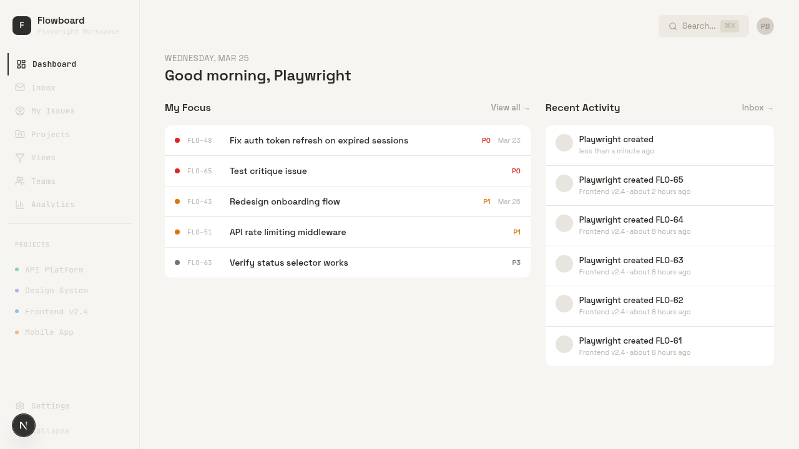
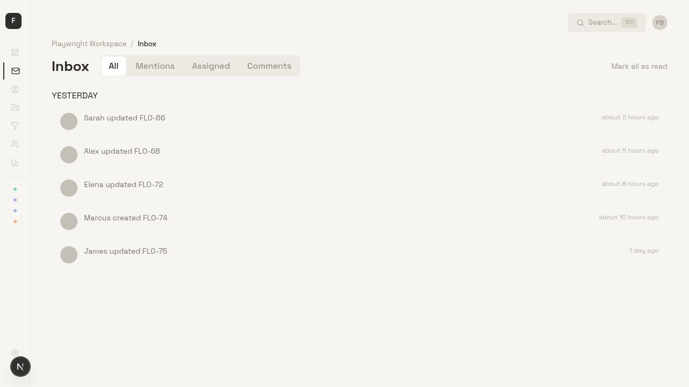
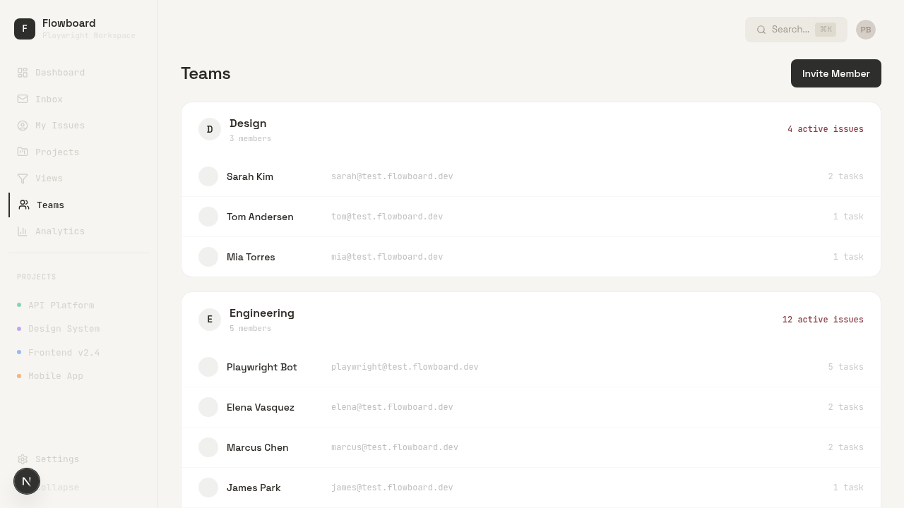
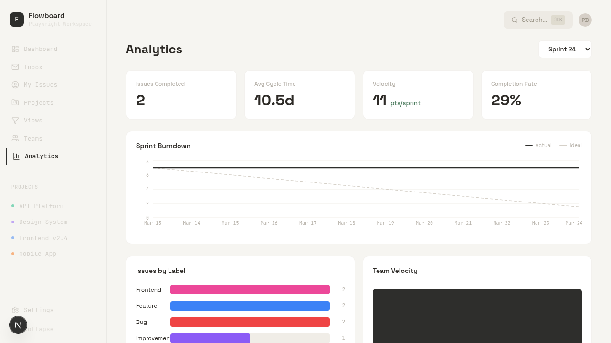
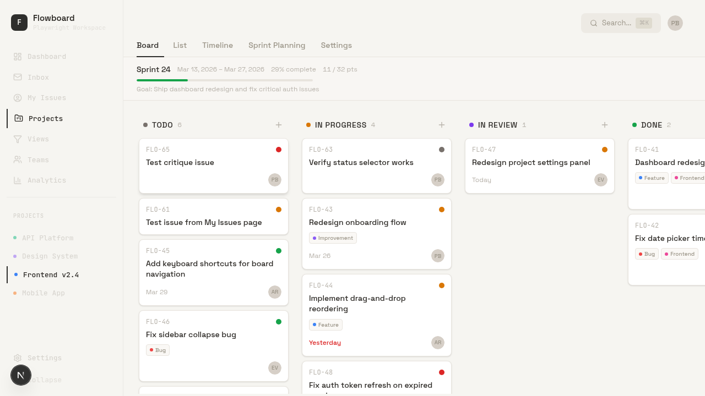
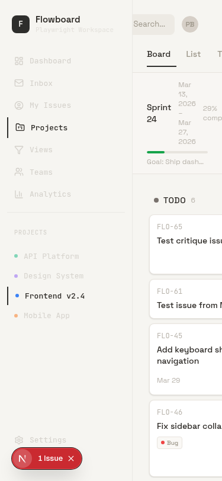

# Flowboard Product Critique

**Perspective**: Senior engineer on an 8-person team evaluating whether to switch from Linear.

**Method**: Walked every page, clicked every interactive element, tested workflows end-to-end, tested at 375px mobile viewport. Screenshots attached.

---

## S-Tier: Dealbreakers

### 1. Dashboard is a display case, not a launchpad

The dashboard shows "My Focus" issues and "Recent Activity" — but **nothing is clickable**. Not the issue rows, not the activity items. You see "FLO-73: Fix auth token refresh on expired sessions" staring at you, but clicking it does nothing. The URL stays on `/dashboard`.

In Linear, every item on every surface is a portal to the thing it represents. You click an issue, you're in the issue. Flowboard's dashboard is a poster of your work, not a tool for doing it. The "View all →" link sends you to My Issues, but you still had to context-switch to a different page to interact with the same data you were already looking at.

**Why this causes churn**: The dashboard is the first thing you see every day. If it's inert, people learn to skip it. Then it's dead weight in the nav. Linear's home feed is useful because every element is actionable — you can triage from the homepage without ever navigating away.

**What good looks like**: Linear's home screen. Every issue is clickable. Activity items link to the issue. You can change status inline. The dashboard IS the triage workflow, not a preview of it.

---

### 2. Inbox is a dead-end notification dump

Clicking a notification marks it as read (visually — though I couldn't actually see a read/unread visual distinction) but **does not navigate to the related issue**. The URL stays on `/inbox`. There's no way to jump from "Sarah updated FLO-66" to FLO-66.

The Mentions, Assigned, and Comments tabs exist but are empty with seed data — and structurally, they filter by notification type, but since the app doesn't generate mention or comment notifications (there's no commenting system), two of the four tabs are phantom features.

**Why this causes churn**: An inbox that doesn't take you to the thing it's notifying you about is useless. People will check Slack/email instead. Linear's inbox is the core triage surface — click a notification, you're in the issue, you can act on it immediately.

**What good looks like**: Linear's inbox. Click notification → issue detail opens inline. Keyboard shortcuts to triage (archive, snooze, mark done). Notion's inbox also links directly to the referenced block/page.

---

### 3. No commenting, no @mentions, no conversation

There is no way to have a discussion on an issue. The issue detail modal shows title, description, status, priority, assignee, due date, story points, and labels — but no comment thread, no activity history, no @mention system.

This is the single biggest reason I'd go back to Linear in a week. Engineering work lives in the conversation around the issue: "I tried approach X, it didn't work because Y, here's what I'm trying next." That context is more valuable than the status field.

**Why this causes churn**: Without comments, the team has to discuss issues in Slack. Context gets fragmented. Decisions get lost. New team members can't onboard by reading the issue history. This is a fundamental gap, not a feature request.

**What good looks like**: Linear has threaded comments with @mentions, reactions, and rich text. Height has "activities" that interleave status changes with conversation. Even Trello has a comment thread on every card.

---

### 4. No issue activity / audit trail visible to users

When someone changes an issue's status, priority, or assignee — where does that show up? The `activities` table exists in the database, but there's no UI surface that shows "Elena changed status from Todo to In Progress" on the issue detail modal. The dashboard's "Recent Activity" shows "Playwright created FLO-65" but it's not clickable and doesn't show the delta.

**Why this causes churn**: You can't answer "what happened to this issue?" without asking someone. Linear shows a full timeline of every change on every issue. When you're debugging a stalled sprint, you need to see the history.

**What good looks like**: Linear's issue sidebar activity feed. Every status change, assignment, comment, and label change is logged with actor and timestamp. GitHub issues do this too.

---

## A-Tier: Serious Structural Problems

### 5. Teams page is read-only — no connection to work

The Teams page shows 3 teams with member lists and an "active issues" count. But you can't click a team to see their issues, workload, velocity, or any team-level view. It's a roster, not a management tool.

Meanwhile, Settings → Members is a separate people-management surface with the same members but different presentation (roles, invite links). Two surfaces for "who's on the team" with no connection to "what's the team doing."

**Why this causes churn**: If I want to see what the Engineering team is working on, I have to mentally cross-reference the Teams page with the Projects page with the board views. Linear's team view shows the team's issues, cycles, and workload in one place.

**What good looks like**: Linear's team pages. Click a team → see their active cycle, issue list, workload distribution. The team IS a scope for viewing work, not just a membership list.

---

### 6. Analytics is sprint-scoped only — useless for most workflows

Analytics requires a sprint to be selected. If your team doesn't use sprints (many teams do kanban or continuous flow), the analytics page is empty. Even for sprint teams, there's no cross-sprint trending, no assignee breakdown, no cycle time distribution.

The KPI cards show headline numbers (2 issues completed, 10.5d avg cycle time, 11 pts/sprint velocity, 29% completion) but provide no drill-down. What contributed to the 10.5d cycle time? Which issues dragged? You can't find out.

**Why this causes churn**: Linear gives you analytics that work regardless of methodology — cycle time, throughput, SLA tracking. Height gives you custom charts. Flowboard's analytics are a sprint report card with no way to investigate the numbers.

**What good looks like**: Linear's analytics. Cycle time distribution histograms. Throughput charts over time. Filter by team, project, label. Works whether you use cycles or not.

---

### 7. No filtering or search on list/board views

The project board and list views show all issues with no way to filter them. No filter bar, no quick filters by assignee/label/priority, no search within the project. The only way to find a specific issue is the global command palette (⌘K).

Sprint Planning has filters (P0 Critical, Unassigned, Bugs, My Issues) — but those are local to that view and don't exist anywhere else. My Issues has a sort dropdown but no filters at all.

**Why this causes churn**: With 20 issues it's manageable. With 200, the board becomes a wall of cards. Linear lets you filter any view by assignee, label, priority, status, and combine them with AND/OR logic. That's table-stakes for a team of 8.

**What good looks like**: Linear's filter bar. Persistent across views. Combinable. Keyboard-accessible (type `is:todo assignee:me label:bug`).

---

### 8. Issue detail modal is functional but shallow

The issue detail modal works — you can edit title, description, status, priority, assignee, due date, story points, and labels. But:

- No comments or activity (covered above)
- No sub-issues or task checklists
- No issue linking (blocked by, relates to, duplicate of)
- No markdown in description (plain textarea)
- No keyboard shortcuts to change fields
- No URL that can be shared (it's a modal, not a page — no permalink)

The modal is a form, not a workspace. You fill in fields and close it. There's no reason to spend time in it.

**Why this causes churn**: Linear's issue view is where you live. You write updates, link related issues, break down tasks, and share the URL in Slack. Flowboard's modal is where you set metadata. That's a different product.

**What good looks like**: Linear's issue detail. Full-page or side-panel. Markdown description with preview. Comment thread. Sub-issues. Relations. Attachments. Shareable URL. Keyboard shortcuts for every field.

---

## B-Tier: Structural Friction

### 9. Views are disconnected from the rest of the product

Saved Views exist and support comprehensive filters (status, priority, assignee, project, due date range). But:

- There's no way to save a filter from a board/list view — you have to go to the Views page and create one from scratch
- Views show a flat table of issues with no board/list/timeline toggle
- No shared views (there's no visibility/sharing model)
- Filter chips on the view detail page can be removed, but there's no way to add new filters without creating a new view

Views feel like a standalone feature bolted on, not an integrated part of the workflow.

**What good looks like**: Linear's custom views. Save any filter configuration. Switch between list/board/timeline on the saved view. Share with team. Pin to sidebar.

---

### 10. Sprint Planning is good but isolated

Sprint Planning is actually one of the better features — two-pane layout, quick filters, capacity tracking, team load visualization. But:

- It lives as a tab inside a project, so you can't plan across projects
- Completing a sprint doesn't flow into analytics smoothly (you have to go to a separate Analytics page and select the sprint)
- There's no sprint retrospective or notes surface
- No sprint goal visible on the board during the sprint

**What good looks like**: Linear's cycles. Cross-project scope. Sprint goal visible on all views. Automatic rollover of incomplete issues. In-flow analytics.

---

### 11. Mobile: functional but unpolished

The mobile experience is better than expected — hamburger menu works, sidebar is a drawer, dashboard adapts well. But:

- **My Issues list view**: issue titles completely invisible at 375px (the TITLE column gets zero width, only ID/PROJECT/PRIORITY show)
- **Command palette**: fixed at 640px width, completely overflows the 375px viewport — unusable on mobile
- **Dashboard "Recent Activity"**: the two-column grid doesn't collapse, pushing the entire right column off-screen
- **Board view**: horizontal scroll works but only shows one column at a time, which defeats the kanban overview purpose
- **Sprint Planning**: two-pane layout doesn't stack vertically, each pane gets ~187px — all text truncated
- **Tab navigation**: "Sprint Planning" wraps to two lines, "Settings" gets cut off
- **KPI cards on Analytics**: partially cut off at right edge
- **Inbox notification read/unread**: unread styling only works for "TODAY" bucket — older unread notifications look identical to read ones

**What good looks like**: Linear's mobile app. Purpose-built for mobile, not just responsive. Single-column issue list with all info visible. Swipe gestures for status changes.

---

## C-Tier: Design Debt

### 12. Two people-management surfaces

Teams page (roster + issue counts + invite) and Settings → Members (roles + invite link) manage the same people with different UIs. Neither links to the other. "Invite Member" on Teams generates an invite link; "Generate invite link" on Settings/Members does the same thing. Pick one.

### 13. Timeline view is starved of data

Timeline only shows issues with due dates set. In the test workspace, 2 of 6 issues in a project have due dates, so the timeline shows 2 bars floating in space. There's no way to set due dates from the timeline view itself (drag to set dates, like Linear's project timeline). If teams don't religiously set due dates, this page is always empty.

### 14. No keyboard-first experience

⌘K (command palette), ⌘N (create issue), and ⌘, (settings) exist. But there are no keyboard shortcuts for the most frequent actions: changing issue status, assigning issues, navigating between issues, or moving between views. Linear is keyboard-first — you can triage 20 issues without touching the mouse.

### 15. No bulk operations

Can't multi-select issues to change status, reassign, or move to a sprint. On a team of 8 with 100+ active issues, you need to be able to "select all P0 bugs → assign to me → move to current sprint" in one action.

### 16. No user avatar dropdown — no way to log out

The top-right avatar ("PB") looks interactive but does nothing when clicked. Every SaaS app with a top-right avatar makes it a dropdown — Gmail, GitHub, Linear, Slack, Notion. Users click it reflexively and get nothing.

More critically: **there is no sign-out button anywhere in the app.** No logout, no session management, no "switch workspace." This is a security concern on shared machines and a basic expectation for any authenticated app.

Profile editing lives in Settings → Profile (two clicks from the sidebar bottom), which is fine — Linear does the same. But the avatar should be a quick-access dropdown with: user name/email, link to profile settings, and sign out. Account-level actions belong on the account indicator, not buried in workspace settings.

**What good looks like**: Linear's avatar dropdown — name, email, theme toggle, sign out. GitHub's avatar dropdown — profile, settings, sign out, switch account. Keep it minimal, but it has to exist.

---

## Summary: What would send me back to Linear in a week

1. **No comments** — can't discuss work where the work is tracked
2. **Dashboard/Inbox dead-ends** — core navigation surfaces don't connect to actions
3. **No filtering on work views** — can't find what I need when issue count grows
4. **No issue permalinks** — can't share a link to an issue in Slack
5. **No activity audit trail** — can't answer "what happened?"
6. **No keyboard triage** — too many clicks for daily workflow

Flowboard has a solid foundation — the data model is right, the board with drag-drop works, sprint planning is well-designed, and the create issue modal covers all fields. But it's a **project database**, not a **workflow tool**. The gap is in the connective tissue: every surface should be a portal to every other surface, every item should be actionable where you see it, and the product should support the speed of thought, not the speed of navigation.
