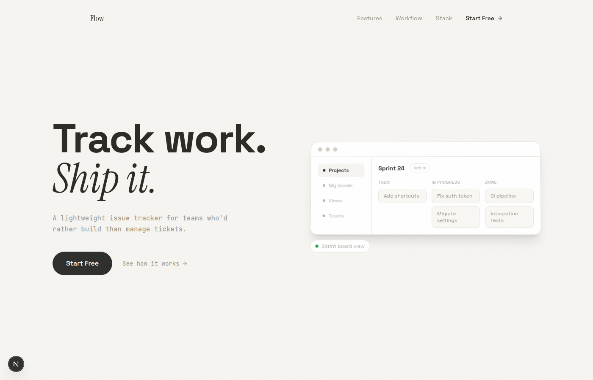
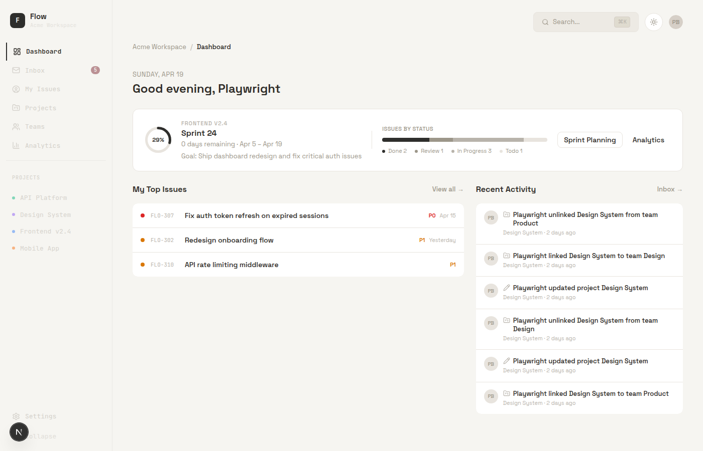
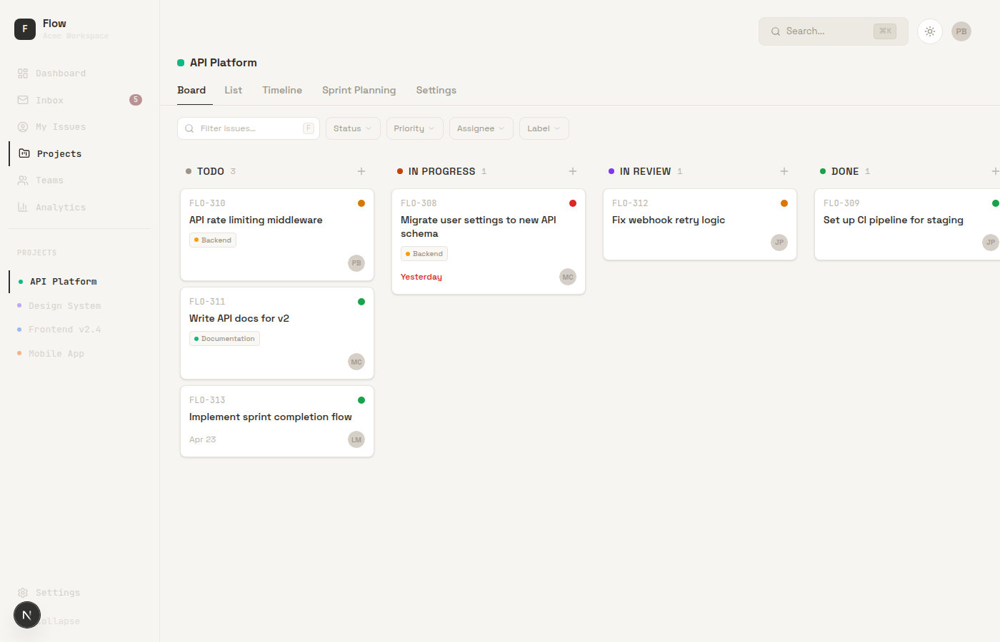
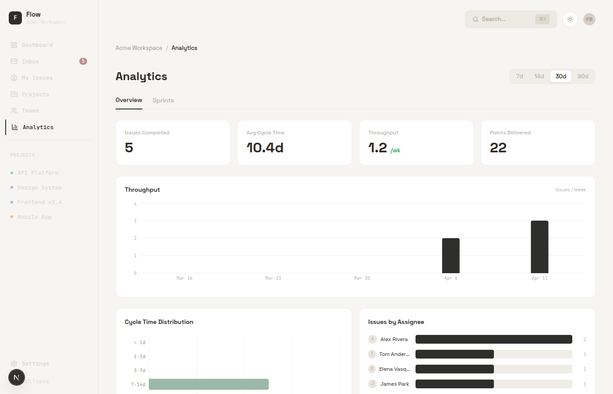
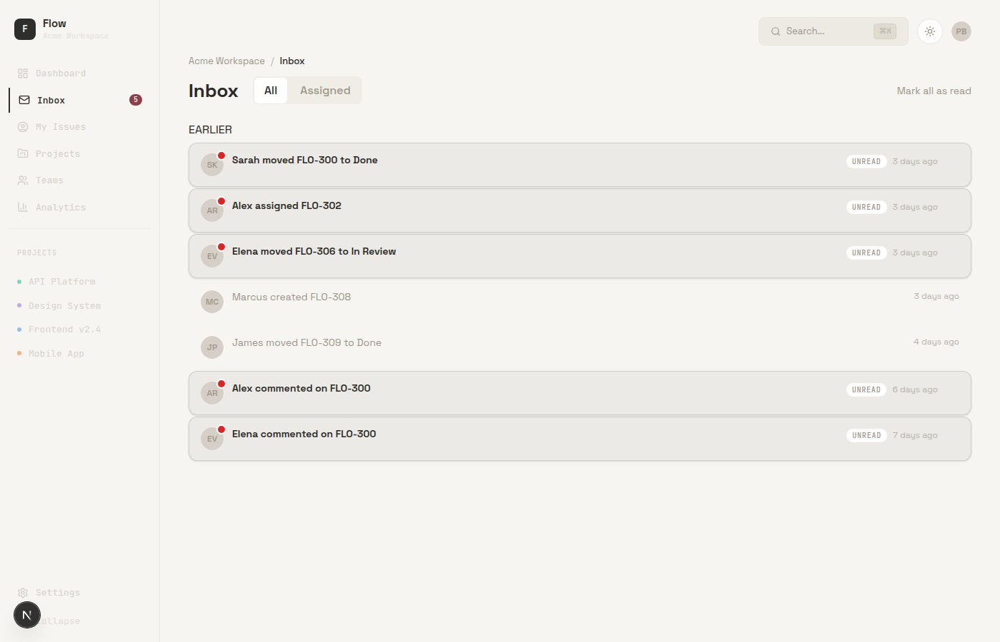

# Flow

**Live at [flowpm.vercel.app](https://flowpm.vercel.app)**

## About

Flow is a project management app for small product teams. Projects, sprints, issues, and analytics, all in one app.
## A tour

### Dashboard

Active sprint at the top, your assigned issues, and an activity feed showing what the rest of the team has been up to. First thing you see after signing in.

### Board

Kanban with filters for status, priority, assignee, and label. Drag-and-drop is built on dnd-kit with optimistic updates, so moving a card doesn't wait on the network.

### Analytics

Throughput, cycle time, cycle-time distribution, per-assignee delivery. Aggregations run on the server; charts are Recharts.

### Inbox

Notifications for activity on issues you care about. Filter by assigned or all, mark everything read in one click.

## Built with

- Frontend: Next.js 16, React 19, TypeScript, Tailwind v4, GSAP + Lenis for motion
- Backend: Supabase (Postgres, Auth, Row-Level Security), Server Actions, Realtime channels
- Editor & UX: TipTap, Radix, dnd-kit, cmdk, Recharts

Built as a Senior Project
