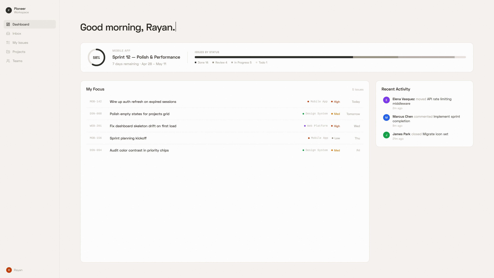

# Flow

A lightweight issue tracker for teams who'd rather build than manage tickets.

**[Try it live →](https://flowpm.vercel.app)**

## Stack

Next.js 16 · React 19 · TypeScript · Tailwind v4 · GSAP + Lenis · Supabase (Postgres, RLS, Realtime) · TipTap · Radix · dnd-kit · cmdk · Recharts

---

Built as a Senior Project.
